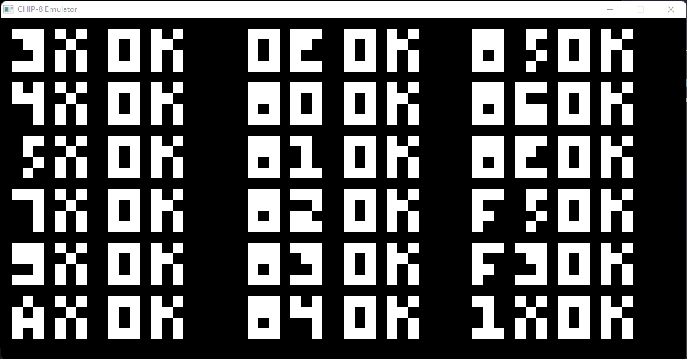
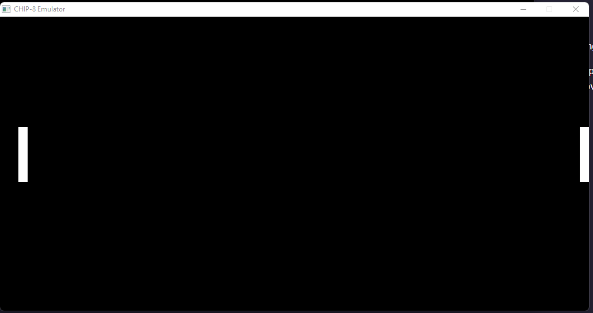
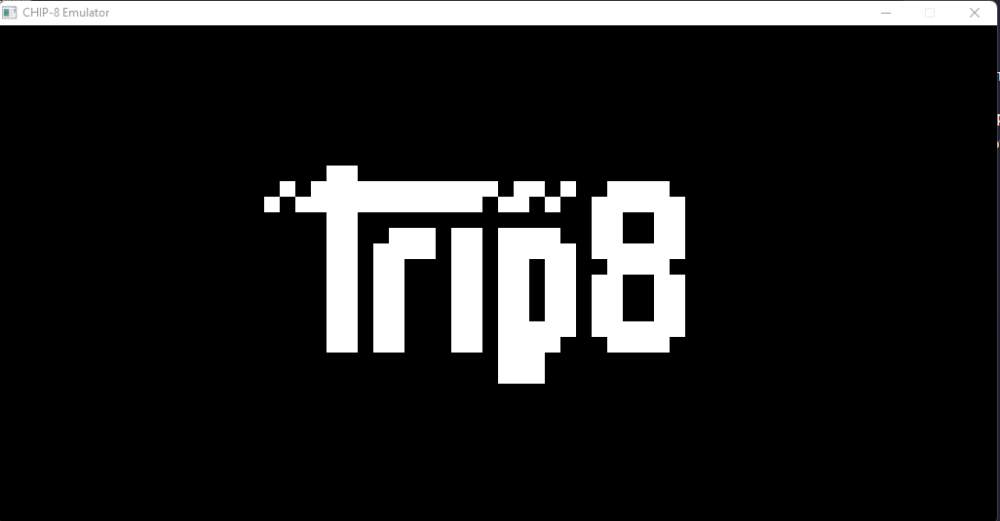

# 👾CHIP-8 Emulator👾
CHIP-8 implement in pure C++.


## Summary
Chip-8 implementation in C++ programming language while
I was learning the language.  
If you see something to improve on my code, your welcome to add a comment or create a PR, It will help me a lot to improve.

*I will improve the emulator gradually.*

## Built with 🧰
- [C++](https://isocpp.org/std/the-standard)
- [SDL2](https://www.libsdl.org/)

## Usage 📐
First of all, you need to install cmake and SDL2

For Linux
```commandline
$ sudo apt-get install cmake libsdl2-dev
```

For Mac OS
```commandline
$ brew install cmake sdl2
```

Then, you need to compile the project and execute the binary/.exe file.
```commandline
$ mkdir build
$ cd build
$ cmake ..
$ make
```

and to run:
```commandline
$ ./chip8 <ROM filename>
```
and that's all, enjoy 😊.

## Next Steps (TODO)
-[ ] Add sound/beeper support
-[ ] Improve execution timing
-[ ] Add [Super CHIP-8](https://johnearnest.github.io/Octo/docs/SuperChip.html) Support 
-[ ] Add [XO-CHIP](https://johnearnest.github.io/Octo/docs/XO-ChipSpecification.html) support
-[ ] Use [function pointers](https://multigesture.net/wp-content/uploads/mirror/zenogais/FunctionPointers.htm) instead of a giant switch statement
-[ ] Improve graphics by adding filters ([Hqx](https://en.wikipedia.org/wiki/Hqx))
-[ ] Port it to other platforms (`Mobile`? some portable video console?) or languages
-[ ] Move on to a more complex project for example emulating a Gameboy (Z80 processor)
-[ ] Add Xbox and/or PlayStation controller support
-[ ] Create a Chip-8 game

## Technical Ref
### Memory Map diagram

```
+---------------+= 0xFFF (4095) End of Chip-8 RAM
|               |
|               |
|               |
|               |
|               |
| 0x200 to 0xFFF|
|     Chip-8    |
| Program / Data|
|     Space     |
|               |
|               |
|               |
+- - - - - - - -+= 0x600 (1536) Start of ETI 660 Chip-8 programs
|               |
|               |
|               |
+---------------+= 0x200 (512) Start of most Chip-8 programs
| 0x000 to 0x1FF|
| Reserved for  |
|  interpreter  |
+---------------+= 0x000 (0) Start of Chip-8 RAM

```

The original CHIP-8 used a hexadecimal keyboard so, for
these times I changed the keys to normal keyboards:

```
Keypad       Keyboard
+-+-+-+-+    +-+-+-+-+
|1|2|3|C|    |1|2|3|4|
+-+-+-+-+    +-+-+-+-+
|4|5|6|D|    |Q|W|E|R|
+-+-+-+-+ => +-+-+-+-+
|7|8|9|E|    |A|S|D|F|
+-+-+-+-+    +-+-+-+-+
|A|0|B|F|    |Z|X|C|V|
+-+-+-+-+    +-+-+-+-+
```

## Screenshots





### Resources
- https://wiki.libsdl.org/APIByCategory
- https://austinmorlan.com/posts/chip8_emulator/
- http://devernay.free.fr/hacks/chip8/C8TECH10.HTM#00E0
- https://tobiasvl.github.io/blog/write-a-chip-8-emulator/#make-a-chip-8-emulator-for-an-obscure-system